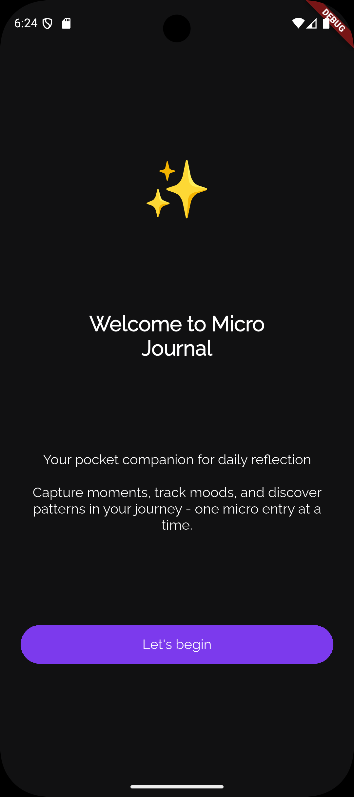

# Micro Journal
Micro Journal is an online social journaling app that allows users to share personal journal entries with a community. The app includes an optional anonymity feature, giving users the freedom to express themselves openly or privately. Users can interact with each other's entries through comments, creating a space for meaningful engagement. Each user is limited to one journal entry per day, but they can comment freely and unlimitedly on other users' entries. Whether writing publicly or anonymously, Micro Journal fosters a thoughtful, supportive environment for sharing daily thoughts, reflections, or experiences.

## 🧠 Micro Journal – Functional Features List

### ✍️ 1. **Daily Entries**

- Users can log:
    - A short thought / reflection
    - A mood (e.g., emoji or color scale)
    - A daily goal or intention
- Only **one log per day** (enforced)
- Auto-save drafts
- Tag entries (e.g., "gratitude", "stress", "win")

---

### 📅 2. **Visual Mood Calendar**

- Month-view grid with color-coded mood dots or emojis
- Click a date to view the journal entry

---

### 🕵️‍♂️ 3. **Anonymous Mode**

- Toggle: “Post today’s entry anonymously”
- Allows public sharing without linking to user identity

---

### 🌍 4. **Public Explore Page**

- Feed of anonymous or public entries
- Filter by:
    - Anonymous Journal
    - My Journal
    - Following
    - All
- Light interaction: 🫶 Like or react (anonymous or not)

---

### 👤 5. **User Profiles**

- Private dashboard: mood stats, streaks.
- Optionally make anonymous entries.
- Display:
    - Mood trends (chart)
    - Favorite tags
    
---

### 📈 6. **Analytics**

- Mood over time (line chart or bar graph)
- Word frequency cloud (common words used)

---

### 🔔 7. **Reminders & Streaks**

- Daily reminder push notification.

---

### 👤 8. **Follow**

- Users can follow Journal creators who are not anonymous.

---

### 📷 **ScreenShots**

        

      

        

      

        

      

## 🤓 Author(s)
**Micheal Olatunbosun**
